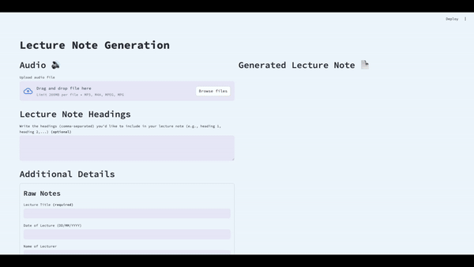

# Lecture Note Generation Application

<p align="center">
    
</p>

## Overview

The Lecture Note Generation Application is designed to streamline the creation of lecture notes from audio recordings and supplementary text inputs. By utilising advanced speech-to-text technology alongside OpenAI's Assistant API, the app converts lecture recordings into clean, summarised transcriptions. Users can also input additional notes, allowing the application to generate comprehensive and organised lecture notes that summarise all key points for easy reference.

## Features

- **Audio Processing:** Converts lecture recordings into accurate transcriptions using speech-to-text technology.
- **Text Analysis:** Analyses supplementary text inputs, such as raw notes taken by the user.
- **Lecture Note Generation:** Produces detailed and organised lecture notes that summarise key points, which users can download for future reference.

## Installation (to run locally)

1. Clone this repository:
```bash
git clone https://github.com/shingurding/lecture-note-generation-app.git
```

2. Set up a virtual environment:
```bash
python -m venv .venv

# Activate virtual environment
source .venv/bin/activate

# On windows
.venv\Scripts\activate
```

3. Install dependencies:
```bash
pip install -r requirements.txt
```

4. Configure API keys:
- Create a `secrets.toml` file under `.streamlit` folder based on `secrets.example.toml` template.
- Add your OpenAI API key (`OAI_API_KEY`) and OpenAI API endpoint (`OAI_API_ENDPOINT`).

5. Run the application:
```bash
streamlit run app.py
```

## Repository Structure
```graphql
.
├── app.py               # Main application script
├── api_call.py          # Manages API interactions
├── config.py            # Configuration file for setting up the app
├── utils.py             # Utility functions for processing data
├── prompts.py           # Pre-defined prompts used in the app
├── .streamlit           # Streamlit configuration and secrets
│   ├── config.toml
│   └── secrets.toml     # Contains API keys (excluded from version control)
```